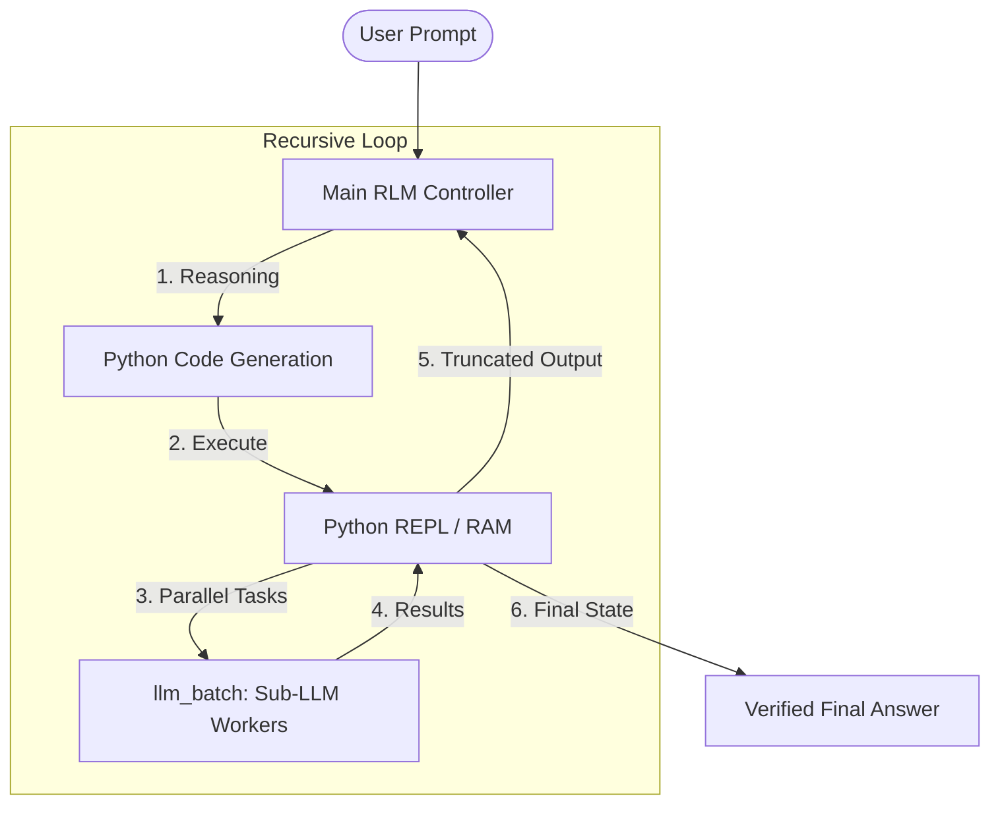

# 🧠 Recursive Language Model (RLM) System


[](https://www.python.org/)
[](https://fastapi.tiangolo.com/)
[](https://ai.pydantic.dev/)
[](https://opensource.org/licenses/MIT)

**✅ Successful project** — This repository is a **successful implementation** of a full-stack Recursive Language Model system. It was built, tested end-to-end, and deployed with a working FastAPI backend, streaming SSE API, REPL-backed orchestration, and a modern frontend. The project successfully demonstrates context slicing, data analysis, and iterative refinement on large inputs using OpenAI and OpenRouter.

---

### What This Project Is

A **production-ready agentic AI pipeline** where a main LLM acts as a controller: it writes and executes Python in a sandboxed REPL, delegates sub-tasks to parallel sub-LLM workers via `llm_batch()`, and iteratively refines an answer until it is marked ready. The backend exposes a streaming `/process` API; the frontend provides a glassmorphic UI for prompts, input data (e.g. transcripts or logs), and live execution logs. Ideal for **podcast summarization**, long-document analysis, and any task that benefits from infinite effective context without context rot.

> **Unlock Infinite Context.** Transform LLMs from "information sponges" into **orchestrators** that use code and parallel delegation to solve complex, data-heavy tasks.

---

### Project Status

| Component   | Status |
|------------|--------|
| **Backend** | ✅ FastAPI + PydanticAI, streaming SSE, REPL executor, `llm_batch` tooling |
| **Frontend** | ✅ Static UI with live log stream and result display |
| **Integration** | ✅ End-to-end tested with OpenAI and OpenRouter |
| **Outcome** | ✅ **Successful attempt** — runs locally and is deployable to Railway, Render, or a VPS |

---

## 💡 The Core Thesis

Traditional LLMs suffer from **Context Rot**—as the context window fills, performance degrades, costs skyrocket, and details are lost. 

The **Recursive Language Model (RLM)** flips this paradigm. Instead of cramming data into the model, the RLM uses **Python as extended memory** and **Parallel Delegation** to process gigabytes of data while keeping the main orchestrator's context lean and sharp.

---

## ✨ Key Pillars of RLM

| Feature | Description | Potential |
| :--- | :--- | :--- |
| 🛡️ **Zero-Rot Context** | The main model never sees raw data; it writes code to slice, search, and retrieve only what is needed. | Process million-token documents with 8k tokens of context. |
| 💾 **Persistent REPL State** | Python variables act as the LLM's RAM, persisting across multiple thought iterations. | Build complex datasets incrementally without losing state. |
| 🚀 **Parallel Delegation** | Spawn a "Sub-LLM Orchestra" via `llm_batch()` to process data chunks in parallel. | 10x-100x speedup for large-scale summarization or analysis. |
| 🎨 **Diffusion Answers** | Answers are built iteratively, refined across turns until a "ready" flag is set. | High-fidelity, self-verified, and fact-checked outputs. |

---

## 🏗️ Architecture



---

## 🚀 Quick Start

### 1. Prerequisites
- Python 3.9+
- An API Key (OpenRouter, Together AI, or OpenAI)

### 2. Installation
```bash
# Clone and navigate
cd backend

# Install dependencies
pip install -r requirements.txt
```

### 3. Configuration
Create a `.env` file in the `backend` directory:
```env
OPENAI_API_BASE=https://openrouter.ai/api/v1
OPENAI_API_KEY=your_key_here
OPENAI_MODEL_NAME=meta-llama/llama-3.1-70b-instruct
```

### 4. Run the System
```bash
# Start Backend
python main.py

# Launch Frontend
# Open frontend/index.html in any browser
```

---

## 🧪 Demo Cases to Try

1.  **Context-Slicing Summary**: 
    - *Input*: A massive 50MB log file or book.
    - *Prompt*: "Summarize the key events in this data by chunking it into 20 parts and processing them in parallel."

2.  **Scientific Data Analysis**: 
    - *Prompt*: "Scan the input_data, calculate the mean and standard deviation of all numeric values found, and plot the distribution using numpy."

3.  **Iterative Code Refinement**: 
    - *Prompt*: "Write a complex parser for this custom data format. Test it against the first 5 entries. If it fails, fix the code and try again until it's 100% accurate."

---

## 📊 Traditional vs. RLM

| Aspect | Traditional Long-Context | Recursive Language Model (RLM) |
| :--- | :--- | :--- |
| **Data Handling** | Load everything into context | Access programmatically via code |
| **Memory** | Attention-based (decays) | Python variables (persistent) |
| **Scaling** | Larger context window (Expensive) | Parallel sub-LLM delegation (Scalable) |
| **Truthfulness** | Single-pass prediction | Multi-turn iterative verification |

---

## 🛠️ Built With
- **[PydanticAI](https://ai.pydantic.dev/)**: For clean, typed agentic workflows.
- **[FastAPI](https://fastapi.tiangolo.com/)**: High-performance backend routing.
- **[Python REPL](https://docs.python.org/3/library/functions.html#exec)**: Secure evaluation sandbox.
- **Modern HTML/CSS**: Glassmorphic dark-mode frontend.

---
*Built with ❤️ for the future of agentic AI.*
